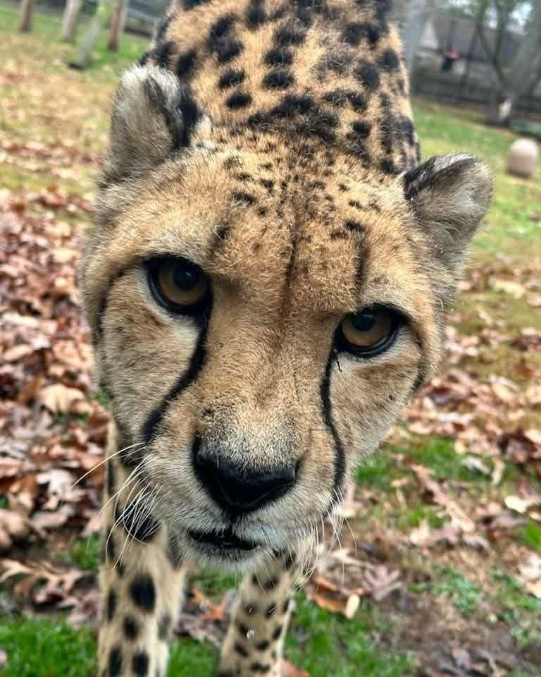

# Creepreee — A critical thinker and Low-Level Explorer

Hi, I’m **Creepreee** 
a curious mind who loves **breaking systems to understand them**, then rebuilding or documenting them. I experiment with **hardware, software, and everything in between**, often at the edge of what’s officially supported.  

---

## 🛠 What I Do

- **Low-Level System Exploration**  
  - Currently learning the **Linux kernel** properly.
  - Trying to **port Ubuntu Touch** on **Samsung A52q**  
  - Deep dives into boot processes especially UEFI/EFI firmware systems

- **Hardware Twinkering**  
  - Love destroying and modding hardware just to see how it works  
  - Successfully fried a resistor of my **Xbox 360** while modding (RIP the legend😅)  
  - Not great at soldering. honestly my skills are messy but enthusiastic  

- **Phone Adventures**  
  - Ported **UEFI on Nokia 7.2**, but **messed up its fartitions** and bricked it.
  - Phones I actively tinker with: **Nokia 7.2 (BRICKED)**, **Samsung A52q**  

- **Self-Hosted & Networking Experiments**  
  - Raspberry Pi tinkering  
  - Cloudflare Tunnel / no-port-forwarding hosting  
  - DNS, networking, and system control  

---

## ⚡ Philosophy

- **Speed > brute force**  
- **Understanding > convenience**  
- **Control > subscriptions**

I don’t just want systems to work — I want to **know why** and **push the limits** of what’s possible.

---

## 📌 Current i am doing:

1. **Linux Kernel Experiments**  
   - Trying new kernel, Porting them, learning
   - Porting Ubuntu Touch to Samsung Galaxy A52 

2. **Android Low-Level Exploration**  
   - EDL 
   - Understand its framework
   - understanding its major changes form mainline linus toevals main branch

3. **Hardware Twinkering**  
   - Raspberry Pi self-hosted services  
   - Experimenting with old devices, learning how they fail

4. **Understanding ERP software like SAP**
   -MM module done
   -more to do

5. **ORACLE APEX**
   -making web apps with oracle apex

6. **UEFI AND ITS PROCESSES**
   - learning how it works and how different phases difder from each other

7. **PRO AFTER EFFECTS SHORTS EDITOR**
   -Edits on after effects
   - my YouTube channel
   - https://youtube.com/@balahatuneditz?si=uLbHyNNVr-xE1bh-

---

## 🧠 Fun Facts

- I often **destroy my own hardware** just to see how it fails.  
- I embrace failure as **the fastest path to understanding**.  
- I have no real soldering skills. everything is trial, error, and curiosity.  

---

## 📱 Devices I Play With

| Device        | Status                      |
|---------------|-----------------------------|
| Nokia 7.2     | Bricked (I actually farted its fartitions lol) |
| Samsung A52q  | Ubuntu Touch porting|
| Xbox 360      | fried motherboard while modding |

---

## 📚 What I’m Learning

- Linux Kernel internals  
- UEFI
- Android system architecture  
- Self-hosted networking solutions
- Oracle Apex

---

> “I break systems to understand them, then rebuild them cleaner, faster, and smarter.”  
> — **Creepreee**

> **I LOVE CHEETAHS♥️**
> 
> Fun fact: cheetahs are actually closely related to house cats than lions. cheetahs are categorized in acinonyx in felinae subfamily of cats while lions are categorized in panthera group. infact domestic cats do also reside in felinae so it means that both acinonyx and domestic cats are very much related. cheetah is the biggest among small cats and hence are not furious to humans at all. they are friendly and soo lovely 😍 ♥️

> fun fact: I have a cheetah but obviously it is just in the sanctuary so it cannot come here to my home. but i can play with him anytime i want. here is the short glimpse of my cheetah:

