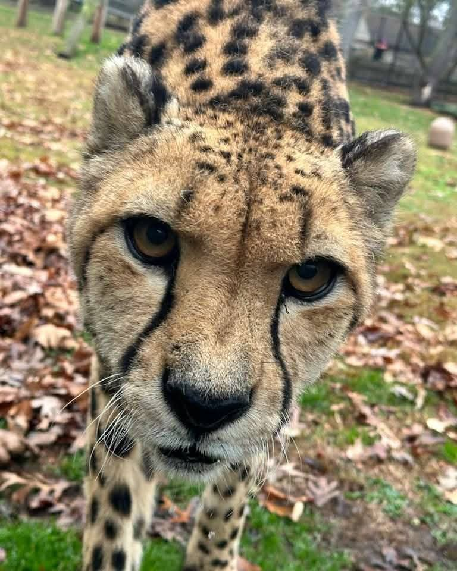

# Creepreee CREEEEEPREEEEEEEE!!!!!!!!

Hi, I’m **Creepreee** 
a curious mind who loves **breaking systems to understand them**, then rebuilding or documenting them. I experiment with **hardware, software, and everything in between and after**, often at the edge of what’s officially supported.  

---

##  What I Do

- **Low-Level System Exploration**  
  - Currently learning the **Linux kernel** properly.
  - Trying to **port Ubuntu Touch** on **Samsung A52q**  
  - Deep dive into boot processes especially UEFI/EFI firmware systems

- **f**!ng Hardware**  
  - Love bricking, destroying and modding hardware just to see how it works  
  - Successfully fried a resistor of my **Xbox 360** while modding (RIP the legend😅)  
  - Not great at soldering. honestly my skills are messy.

- **Phone Adventures**  
  - Ported **UEFI on Nokia 7.2**, but **messed up its fartitions** and bricked it.
  - Phones I actively tinker with: **Nokia 7.2 (BRICKED)**, **Samsung A52q (found firehose finally!!!)**  
  - HP envy leap motion 17 (Inel Me debloated, gooned nvram flash decriptors. time to flush the hell out of stock UEFI)
- **Self-hosted E bussiness/commerce stores for entrepreneurs**
  ** My own bussiness Hostmerce **
  
**Understanding technincal and functional sides of ERP softwares like SAP**
   -MM module done
   -more to do
** Understanding core proccesses of bussiness and its functional implimentation in EBS **
  - partially done several modules like purchasing, OM, AR, GL, IN, AP and many more

**ORACLE APEX Developer**
   -making web apps with oracle apex
   -integrating web apps in ebs and database management with 2 different schemas. one for APPS and one for APEX. using APPS APIs to access stuff from apex and write data to te apex schema.
   
  -converting oracle custom forms into beautiful apex forms. generating reports, etc. also implementing the ability to read the SAP or any other system table's data in APEX forms or more importantnly, reports.
  YOu can see my repos :)

  **PRO AFTER EFFECTS SHORTS EDITOR**
    - Oh yeah i am an editor too
   -Edits on after effects
   - my YouTube channel
   - https://youtube.com/@balahatuneditz?si=uLbHyNNVr-xE1bh-
---

## Philosophy

- **Speed > brute force**  
- **Understanding > convenience**  
- **Control > subscriptions**

I don’t just want systems to work.I want to **know why** and **push the limits** of what’s possible.

---

## Fun Facts

- I often **destroy my own hardware** just to see how it fails.  
- I embrace failure as **the fastest path to understanding**.  
- I have no real soldering skills. everything is trial, error, and curiosity.  

---

## Devices I ~~Play~~ F**k With

| Device        | Status                      |
|---------------|-----------------------------|
| Nokia 7.2     | Bricked (I actually farted its fartitions lol) |
| Samsung A52q  | Ubuntu Touch porting|
| Xbox 360      | fried motherboard while modding |
| Hp envy 17    | gooning with its UEFI :)    |

---

> “I break systems to understand them, then rebuild them cleaner, faster, and smarter.”  
> — **Creepreee**

                                              :: FUNFACT ::

> **I LOVE CHEETAHS♥️**
> 
> Fun fact: cheetahs are actually closely related to house cats than lions. cheetahs are categorized in acinonyx in felinae subfamily of cats while lions are categorized in panthera group. infact domestic cats do also reside in felinae so it means that both acinonyx and domestic cats are very much related. cheetah is the biggest among small cats and hence are not furious to humans at all. they are friendly and soo lovely 😍 ♥️

> fun fact: I have a cheetah but obviously it is just in the sanctuary so it cannot come here to my home. but i can play with him anytime i want. here is the short glimpse of my cheetah:

